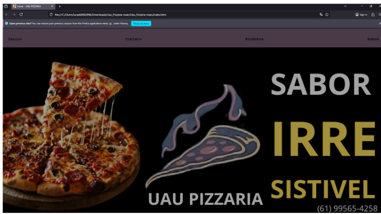

# 🍕 UAU PIZZARIA
---
## 🎯 Descrição do Projeto

O site da **Uau Pizzaria** foi desenvolvido com foco em conversão e experiência do cliente, apresentando:

* Catálogo completo de produtos
* Página inicial estratégica para vendas
* Seções de contato, horários e endereço
* Design moderno, leve e responsivo

---

## 👥 Integrantes e Papéis

* 👩‍💻 **Maria Vitória Ferreira Lopes** — Desenvolvimento de CSS e JavaScript, GitHub e direcionamento do projeto.
* 👨‍💻 **Lucas Braz** — Desenvolvimento do HTML, documentação/README, design no Figma, revisão e testes.

---

## 🎨 Protótipo no Figma

👉 **Protótipo completo:** [https://www.figma.com/design/Elfwch9ThAEVblfzaXGGbm/Uau-Pizzaria?node-id=0-1&t=HmWvGpus6WRHgXWI-1](https://www.figma.com/design/Elfwch9ThAEVblfzaXGGbm/Uau-Pizzaria?node-id=0-1&t=HmWvGpus6WRHgXWI-1)
⚠️ *As imagens das telas também estão no diretório `/docs/wireframe-figma`.*

---
## 🌐 GitHub Pages

🔗 **Acesse o site publicado:**
[https://302781.github.io/Uau_Pizzaria](https://302781.github.io/Uau_Pizzaria)

📅 *Publicado em: 13/11/2025*


---

## 🛠️ Tecnologias Utilizadas

* **HTML5**
* **CSS3**
* **JavaScript**

---
## 📁 Estrutura de Pastas

```
Uau_Pizzaria/
├─ componentes/               → Componentes HTML separados
│   ├─ footer.html
│   ├─ header.html
│   ├─ main.html
│   ├─ nav.html
│   ├─ section.html
│
├─ css/
│   ├─ componentes.css        → CSS dos componentes
│   ├─ style.css              → Estilo principal
│
├─ docs/
|   ├─ avaliacoes-enviadas/
|   |     ├─ Avaliação - Dupla 05.md
|   ├─ avaliacoes-recebidas/
|   |     ├─ Avaliação - Dupla 10.md
|   ├─ Testes/
|   |     ├─ Celular_1.jpg
|   |     ├─ Chrome.png
|   |     ├─ Edge.png
|   |     ├─ firefox.png
│   ├─ wireframe/       → Imagens do Figma
│   │   ├─ contatos.png
│   │   ├─ inicio.png
│   │   ├─ produtos.png
│   │   ├─ sobre.png
│   ├─ rubrica.md             → Documento técnico
│
├─ img/                       → Imagens e ícones
│   ├─ batata.jpeg
│   ├─ carne.jpeg
│   ├─ doce.jpeg
│   ├─ facebook.png
│   ├─ fundo.png
│   ├─ instagram.png
│   ├─ metade_doce.jpeg
│   ├─ metade_salgado.jpeg
│   ├─ metade.jpeg
│   ├─ pizza.jpeg
│   ├─ whatsapp.png
│
├─ js/
│   ├─ componentes.js
│   ├─ fundo.js
│
├─ contatos.html              → Página de formulário
├─ index.html                 → Página inicial
├─ produtos.html              → Catálogo de produtos
├─ sobre.html                 → História, localização e contatos
├─ README.md
```
---
**Parte 1** — Planejamento
Escolha do negócio
Identidade visual
Protótipo / Wireframe no Figma

**Parte 2** — Desenvolvimento
Criação do HTML (Home, Menu, Sobre, Endereço)
Aplicação de layout, cores e fontes
Organização das pastas

**Parte 3** — Publicação e Testes
Correção de caminhos
Ajustes de responsividade
Publicação no GitHub Pages
Testes em resoluções e navegadores
Documentação final
---

## 🔧 Otimizações Realizadas

### ✔ HTML

* Ajuste dos metadados essenciais no `<head>`
* Inclusão do favicon (`img/favicon.png`)
* Melhoria no SEO e compatibilidade entre dispositivos

### ✔ CSS — Minificação

* Ferramenta: **CSS Minifier**
* `style.css` → `style.min.css`
* Remoção de espaços, quebras de linha e comentários
* Arquivo minificado referenciado no HTML

### ✔ JavaScript — Minificação

* Ferramenta: **JavaScript Minifier**
* Arquivos `.js` convertidos para `.min.js`
* Redução de tamanho e carregamento mais rápido

---
# 🧪 Testes

## ✔ Testes em Diferentes Navegadores
* **Layout correto?** Sim  
* **Todas as páginas carregam?** Sim  
* **Imagens aparecem?** Sim  
* **CSS aplicado corretamente?** Sim  
* **JavaScript funcional?** Sim, sem erros  
* **Formulários funcionam?** Sim  
* **Menu e navegação?** Perfeito  

Não houve erros de JavaScript nem problemas relacionados a CORS.

### Navegadores testados (Desktop)
* Chrome  
* Edge  
* Firefox  

### Navegadores testados (Mobile)
* Poco X6 PRO (Android)  
* Xiaomi 12  
* Navegadores: Chrome e Brave (5G)

### 📸 Capturas dos Testes
Chrome
  
Edge
  
Firefox
  
Celular


### 📱 Resoluções testadas
`375x667`, `390x844`, `768x1024`, `1024x1366`, `1280x720`, `1920x1080`

---
##Reflexões

Lucas Braz - Quais foram as principais habilidades técnicas que você desenvolveu?
A organização de documentos, Desenvolvimento do HTML, Figma e revisão e teste.

Qual foi a tecnologia ou conceito mais desafiador de aprender?
O desenvolvimento do HTML e CSS, aprender o uso do Figma 

O que você domina melhor agora comparado ao início do projeto?
Figma e desenvolvimento do HTML e uso mais profissional do Github

Como foi trabalhar em dupla? Quais foram os desafios?
Organizar nossas ideias e combinar de maneira eficaz os elementos do projeto 

Como vocês organizaram as tarefas e a comunicação?
Através de documentos e Scripts separados em aplicativos como Documento

O que funcionou bem na metodologia da dupla?
Divisão de diferentes tarefas para ambos os membros de maneira organizada e bem dividida 

Qual foi o maior desafio do projeto?
Desenvolvimento do JavaScript e design do site 

Como vocês superaram?
Pesquisas análises de outros sites 

Se pudesse voltar no tempo, o que faria diferente?
Fazer o banner mais chamativo e vibrante

Evolução do Projeto:

Como o projeto evoluiu da Parte 1 até agora?
Em vários aspectos incluindo layout e cores mais elaborado, animação de slide de fotos no menu inicial e endereço com Google maps na aba endereço

Quais foram as maiores mudanças/melhorias?
Adaptação em diferentes resoluções e ações mais intuitivas 

O resultado final atende à proposta inicial?
Sim atende as expectativas planejadas

O que vocês aprenderam com a avaliação dos colegas?
Que o site está bem funcional e intuitivo 

Relevância para o Negócio:

O site realmente agregaria valor ao pequeno negócio escolhido?
Sim expandindo para novas formas de atrair clientes meio a serviços online 

Se pudessem apresentar para o dono do negócio, o que diriam?
Apresentaria o site com todas funcionalidades com a lista dos produtos, endereço e sobre a pizzaria a qual foi escolhida

Vocês usariam este projeto como portfólio? Por quê?
Sim usaria pois é um bom exemplo de experiência na área e profissionalismo 

Maria Vitória - 

**Aprendizado Técnico:**
Quais foram as principais habilidades técnicas que você desenvolveu? (HTML, CSS, Git, organização, etc.)
 As principais habilidades técnicas que veu desenvi foi o css e documentação

 Qual foi a tecnologia ou conceito mais desafiador de aprender?
 Nunhuma

O que você domina melhor agora comparado ao início do projeto?
HTML e estrutura de codigos

**Aprendizados de Processo:**

- Como foi trabalhar em dupla? Quais foram os desafios?
Foi mais ou menos, direcionar para o caminho certo.

Como vocês organizaram as tarefas e a comunicação?
Na sala de aula definimos o que cada um ia fazer no projeto.

O que funcionou bem na metodologia da dupla?
Divisão de diferentes tarefas para ambos os membros de maneira organizada e bem dividida 

**Desafios Enfrentados:**

- Qual foi o maior desafio do projeto?
Desenvolvimento do JavaScript e design do site 

Como vocês superaram?
Pesquisas análises de outros sites 

Se pudesse voltar no tempo, o que faria diferente?
Recontruir o codigo e deixa mais chamativo.

---
Reflexão em dupla
---
**Evolução do Projeto:**

Como o projeto evoluiu da Parte 1 até agora?
Em vários aspectos incluindo layout e cores mais elaborado no figma.

Quais foram as maiores mudanças/melhorias?
Adaptação em diferentes resoluções e ações mais intuitivas 

O resultado final atende à proposta inicial?
Nao atende as expectativas planejadas mais esta satisfatório o resultado.

**Feedbacks Recebidos:**
O que vocês aprenderam com a avaliação dos colegas?
Que o site está bem funcional e intuitivo 

Quais feedbacks foram mais úteis?
Tornar a resolução em diferentes telas mais dinâmica e sem erros

- Como pretendem aplicar essas sugestões?
Melhorias no script através do JavaScript e CSS

**Relevância para o Negócio:**

 O site realmente agregaria valor ao pequeno negócio escolhido?
Sim expandindo para novas formas de atrair clientes meio a serviços online

- Se pudessem apresentar para o dono do negócio, o que diriam?
Apresentaria o site com todas funcionalidades com a lista dos produtos, endereço e sobre a pizzaria a qual foi escolhida

- Vocês usariam este projeto como portfólio? Por quê?
Sim usaria pois é um bom exemplo de experiência na área e profissionalismo
---

## 🚀 Próximos Passos e Melhorias Futuras
---
**Melhorias Técnicas Planejadas:**

[]Implementar um sistema simples de pedidos ou carrinho de compras
[]Adicionar textos alternativos completos, navegação por teclado e ARIA roles
[]Criar animações, modais e componentes mais dinâmicos
[]Reescrever páginas usando componentização

---

### 📚 Conhecimentos a Aprofundar

- Aprofundar em **acessibilidade WCAG**, criando interfaces mais inclusivas  
- Estudar **animações CSS avançadas** para melhorar a experiência do usuário  
- Aprender **manipulação de APIs** (fetch, JSON, endpoints)  
- Aprender conceitos fundamentais de **React ou Vue** (componentes, props, estados)  
- Estudar **boas práticas de SEO** para sites estáticos

---
### 🎓 Aplicação em Disciplinas Futuras

O aprendizado obtido neste projeto será aplicado em:

- Desenvolvimento de **projetos web mais completos**, com código mais organizado e modular  
- Criação de **interfaces mais acessíveis**, usando padrões WCAG e boas práticas visuais  
- Uso de **frameworks modernos (React/Vue)** em disciplinas que exigem aplicações mais dinâmicas  
- Melhoria da **documentação técnica**, seguindo padrões já usados neste projeto  
- Aplicação de **testes e validações**, garantindo mais qualidade em projetos futuros  

---

## 🙌 Créditos

Projeto desenvolvido como protótipo estático usando **HTML + CSS + JavaScript**.
Fontes: MDN Web Docs, Youtube:Larissa Kich: https://youtu.be/q3vsAtijvgA?si=B-_cd04ZamEHAEfv) e Dev Club: https://youtu.be/RTfMHMQp2e4?si=RgWNL9gOGOdniwAQ.
--- 


