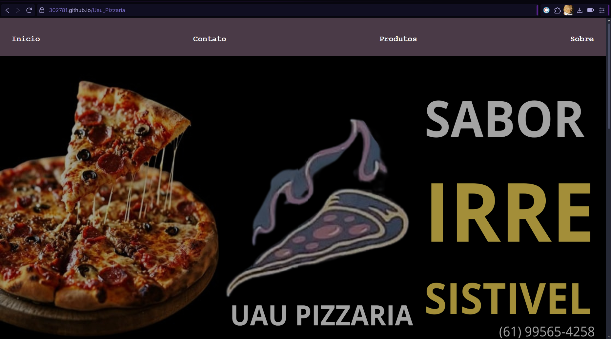

# 🍕 UAU PIZZARIA
---
## 👥 Integrantes e Papéis

* 👩‍💻 **Maria Vitória Ferreira Lopes** — Desenvolvimento de CSS e JavaScript, GitHub e direcionamento do projeto.
* 👨‍💻 **Lucas Braz** — Desenvolvimento do HTML, documentação/README, design no Figma, revisão e testes.

---

## 🎯 Descrição do Projeto

O site da **Uau Pizzaria** foi desenvolvido com foco em conversão e experiência do cliente, apresentando:

* Catálogo completo de produtos
* Página inicial estratégica para vendas
* Seções de contato, horários e endereço
* Design moderno, leve e responsivo

Ideal para pequenos negócios que precisam de uma presença profissional na web.

---

## 🎨 Protótipo no Figma

👉 **Protótipo completo:** [https://www.figma.com/design/Elfwch9ThAEVblfzaXGGbm/Uau-Pizzaria?node-id=0-1&t=HmWvGpus6WRHgXWI-1](https://www.figma.com/design/Elfwch9ThAEVblfzaXGGbm/Uau-Pizzaria?node-id=0-1&t=HmWvGpus6WRHgXWI-1)
⚠️ *As imagens das telas também estão no diretório `/docs/wireframe-figma`.*

---

## 🛠️ Tecnologias Utilizadas

* **HTML5**
* **CSS3**
* **JavaScript**

---

## 🔧 Otimizações Realizadas

### ✔ HTML

* Ajuste dos metadados essenciais no `<head>`
* Inclusão do favicon (`img/favicon.png`)
* Melhoria no SEO e compatibilidade entre dispositivos

### ✔ CSS — Minificação

* Ferramenta: **CSS Minifier**
* `style.css` → `style.min.css`
* Remoção de espaços, quebras de linha e comentários
* Arquivo minificado referenciado no HTML

### ✔ JavaScript — Minificação

* Ferramenta: **JavaScript Minifier**
* Arquivos `.js` convertidos para `.min.js`
* Redução de tamanho e carregamento mais rápido

---
Teste
---
Testes em Diferentes Navegadores

O layout está correto?
sim, em todos os navegadores

Todas as páginas carregam?
sim, adequadamente em todos os navegadores

Imagens aparecem?
Sim todas elas

CSS está aplicado corretamente?
Corretamente e sem erros

JavaScript funciona
Sim e sem erros no script

Formulários estão funcionais?
Sim, em todos os navegadores selecionados

Menu e navegação funcionam?
Sim e adequadamente 

Não há erros no script em nenhum dos navegadores nem no JavaScript ou em  CORS.

Os navegadores usados no computador foram Chrome, Edge e Firefox.
No teste real Mobile foi usado o telefone Poco X6 PRO e Xiaome 12. Todos usando internet 5G.


Testes realizados nas resoluções - 375x667, 390x844, 768x1024, 1024x1366, 1280x720 e 1920x1080.

Testes no Mobile

Funcionaram corretamente em um celular Xiaomi Android com Touch funcionando e carregamento rápido, usando o navegador Chrome e Brave.


## 📁 Estrutura de Pastas

```
Uau_Pizzaria/
├─ componentes/               → Componentes HTML separados
│   ├─ footer.html
│   ├─ header.html
│   ├─ main.html
│   ├─ nav.html
│   ├─ section.html
│
├─ css/
│   ├─ componentes.css        → CSS dos componentes
│   ├─ style.css              → Estilo principal
│
├─ docs/
│   ├─ wireframe-figma/       → Imagens do Figma
│   │   ├─ contatos.png
│   │   ├─ inicio.png
│   │   ├─ produtos.png
│   │   ├─ sobre.png
│   ├─ rubrica.md             → Documento técnico
│
├─ img/                       → Imagens e ícones
│   ├─ batata.jpeg
│   ├─ carne.jpeg
│   ├─ doce.jpeg
│   ├─ facebook.png
│   ├─ fundo.png
│   ├─ instagram.png
│   ├─ metade_doce.jpeg
│   ├─ metade_salgado.jpeg
│   ├─ metade.jpeg
│   ├─ pizza.jpeg
│   ├─ whatsapp.png
│
├─ js/
│   ├─ componentes.js
│   ├─ fundo.js
│
├─ contatos.html              → Página de formulário
├─ index.html                 → Página inicial
├─ produtos.html              → Catálogo de produtos
├─ sobre.html                 → História, localização e contatos
├─ README.md
```

---

## 🧩 Etapas Realizadas

* 🗓️ **09/10/2025** — Escolha do projeto — *Maria Vitória*
* 🗓️ **09/10/2025** — Design no Figma — *Lucas*
* 🗓️ **11/10/2025** — Estrutura inicial HTML — *Lucas*
* 🗓️ **11/10/2025** — Estrutura inicial CSS — *Maria Vitória*
* 🗓️ **15/10/2025** — Finalização do código — *Lucas e Maria Vitória*
* 🗓️ **12/11/2025** — Documentação e ajustes — *Lucas e Maria Vitória*
* 🗓️ **13/11/2025** — Ajustes finais e conclusão — *Lucas e Maria Vitória*

---

## 🧰 Executando Localmente

### Opção 1 (simples)

1. 💾 Baixe o repositório
2. 🌐 Abra `index.html` no navegador

### Opção 2 (com Live Server)

1. 💾 Baixe o repositório
2. 🪟 Instale a extensão **Live Server** no VS Code
3. ▶️ Clique em **Open with Live Server**

---

## 🙌 Créditos

Projeto desenvolvido como protótipo estático usando **HTML + CSS + JavaScript**.

---

## 🌐 GitHub Pages

🔗 **Acesse o site publicado:**
[https://302781.github.io/Uau_Pizzaria](https://302781.github.io/Uau_Pizzaria)

📅 *Publicado em: 13/11/2025*



---
